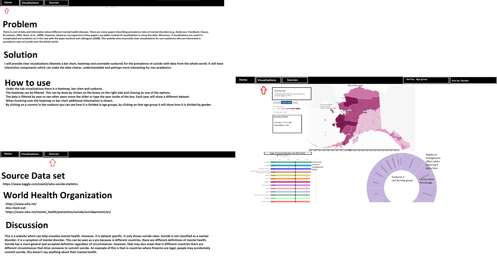
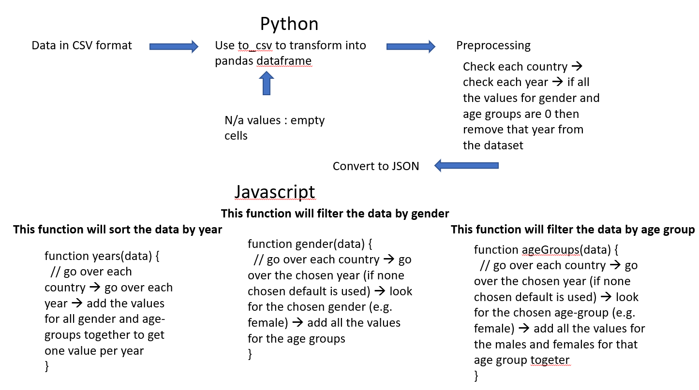

# Suicide rate in the world

## User interface

### Home page
The home page provides information about the problem, solution/ goal and perhaps additional information of what the website can be used for and how it can be used.

### Visualization page
This is what the visualization tab will approximately look like

On the right of the page there will be 2 dropdown buttons to sort by age group or gender.
The slider will be under the world map.
The map will be in the middle of the screen with the bar chart and sunburst below.

### Sources
Some background information about the dataset and how and where it was collected.

Note: Bootstrap will be used for the design of the website.

## Dataset
My data is available as a who-suicide-statistics.csv in the folder code.

I will be using the pandas library to preprocess this data set
In pandas I will transform the CSV to a Pandas DataFrame (pd.df.to_csv).
Here I will choose N/A as empty cells.
If a value is 0 it can be the case that there are 0 suicides. However, it may also be the case that there is no data collected in that year.
Therefore I will remove 0's based on a specific criteria. To date the chosen criteria is: If for all genders and age groups there is no data for a specific year then that year will be removed.

What happens when there is no information for a specific year?
The slider will not show that year as an option.

## Technical Design of dataset

## Heatmap

[source](http://bl.ocks.org/micahstubbs/8e15870eb432a21f0bc4d3d527b2d14f)

I will be using [this](http://bl.ocks.org/micahstubbs/8e15870eb432a21f0bc4d3d527b2d14f) example code.
The [tooltip](http://labratrevenge.com/d3-tip/javascripts/d3.tip.v0.6.3.js) will show on hover the land name,
the number of suicides and the population. However, the dataset is filtered by age, gender and year. The initial heatmap
will show all of this data pooled for the year 1985 (start year). This "pooling" will be done in JavaScript. I will look for the country
then get the information about the year(e.g. in this case the start-year 1985). Take all(female, male and all age groups) the number of suicides from that year, add them together. Do the same for the population. This pooled data is what will be shown in the tooltip unless the data was filtered.

The legend will be a smooth colour [legend](https://www.visualcinnamon.com/2016/05/smooth-color-legend-d3-svg-gradient.html).
The higher the number of suicides the darker the colour of the land. Colours will be chosen via [colorbrewer](http://colorbrewer2.org/#type=sequential&scheme=BuGn&n=3)

### Filter
The data can be filtered based on age group or gender via a dropdown button.
This will be done in JavaScript. I will look for the country, then the year. Only take the data that was chosen in that year.

The data will be sorted by year via a slider. This will be a bit different from the age group and the gender.
You have to choose a year(If the user didn't choose a year the default is used 1985) in order to see any data, you can't see data from all the years pooled.
I will look for the country, and select all the data for that year.

### Extra information
The heatmap has to be updated or drawn again when filtered, because the colours change.

## Bar chart

[source](https://publicadministration.un.org/egovkb/en-us/Data/Compare-Countries)

The bar chart will show the data for the chosen year(from the slider). It is sorted by number of suicides thus, the country with the most suicides will be on top. When you hover the tooltip will show the number of suicides and the population.
It cannot be filtered. It adds value because when you filter your heatmap you can still see the barchart and compare the values with how it used to be (e.g. Albania had the highest value when no filter was chosen. However when the filter female was chosen, Germany had the highest value).

## Zoomable sunburst

[source](https://beta.observablehq.com/@mbostock/d3-zoomable-sunburst)

The zoomable sunbursts starts with all the countries (Countries with more suicide will be bigger. However, this value will be standardized because some countries can have a high number of suicides but also a really big population). When a country is clicked on the information for each age group is shown. When one age group is chosen, the information for gender is chosen. Furthermore, the sunburst is only for a chosen year.
The sunburst gives an alternative form of visualization. In the heatmap the data is visualized mostly based on colours. In the sunburst you can see size, thus a country with more suicides will be bigger (have a bigger slice in the pie) same for the age group and gender.
Moreover, all the information for that country will be present. Thus you don't have to filter anything and you can easily compare all the different dimensions (Country, age and gender).

The goal is when the user clicks on another country the sunburst zooms out on the previously chosen country and zooms in the new country.

## External components
- Bootstrap
- d3 version (5.7.0)
- d3 tooltip
- flare visualization toolkit
