# day 2 (8 - 01 - 2018)
I made the design of the Home and Sources page.
At first I was using colored divs to seperate my text.
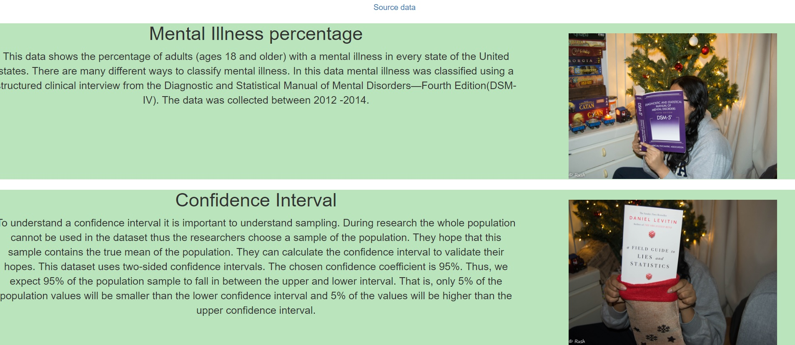
However, I discovered bootstrap cards. Which I used in my design in place of divs.
Ultimately I feel cards are handier to use and easier to contain. They also make the code a bit more readable.
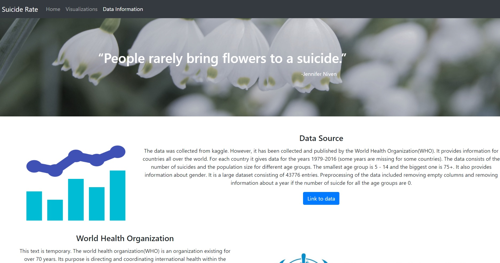

# day 3 (9 - 01 - 2018)
I started the day preprocessing my data. I feel I have discovered an important part of pandas.
I used GroupBy to group my data based on country and year. Many transformations can be performed on these groups.
Illustrated in the [GroupBy article](http://pandas.pydata.org/pandas-docs/stable/groupby.html).
Of the most notable ones, you can sum your groups, calculate mean, std and many more statistics.
You can also transform your data such as calculate the Z score and transform the values to Zvalues.
For the preprocessing, I removed years where all the number of suicides were 0. I also removed empty cells.
This file is in [suicide.json](project/data/suicide.json).
I summed all the values for each group (so each country and each year has 1 value for the number of suicides).
This can be found in [suicide_pooled.json](project/data/suicide_pooled.json).

I also started the visualization of the heatmap.
Here is a picture of what it looked like at the end of the day.
My data was not loaded in yet, and none of the links for filtering work.
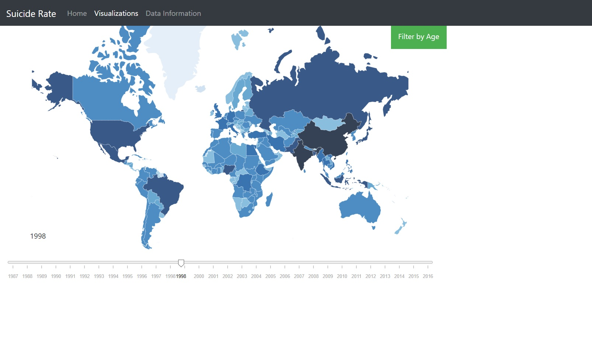

# day 4 (10 - 01 - 2018)
I linked my data to my map. I learned that a lot of countries are missing in my data.
I did not make any big insights but I do have a big to do list.
- Most importantly a suicide number of a country with a big population will most likely be higher than that of a country with a small population.
In this case the colours do not say anything. I need to find a solution for this.
- Write the update function.
- All visualizations should be done next week Friday thus I need to work on those before I link my visualizations.
- Another thing to note is that you cannot use window.onload twice. A main file must be made that calls all the functions at the same time.

# day 5 (11 - 01 - 2018)
I decided to calculate the number of suicides per 10000. As that gives more insight and makes it better comparable.
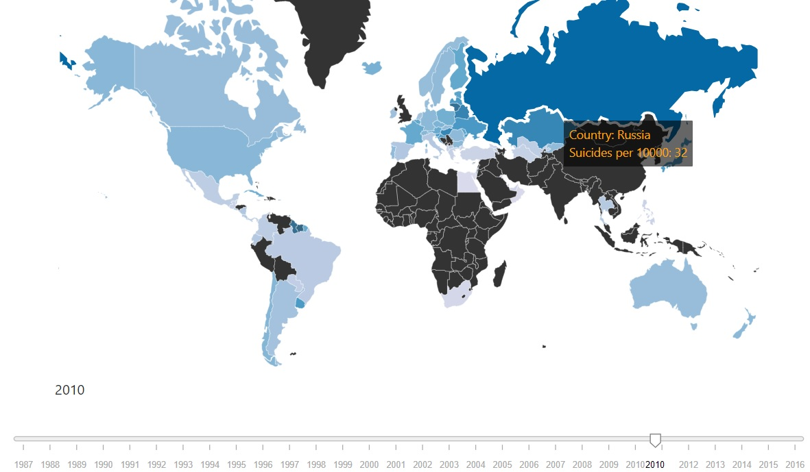
I also made a side box. Where when you hover over a country more data appears in the box.
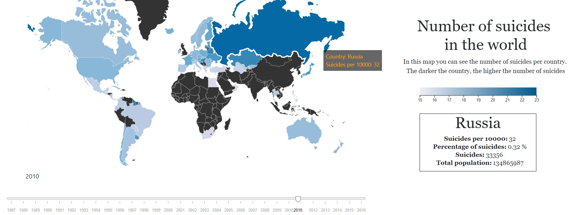
I finished the bar chart. Which was very long so I decided to make the user be able to scroll through it.
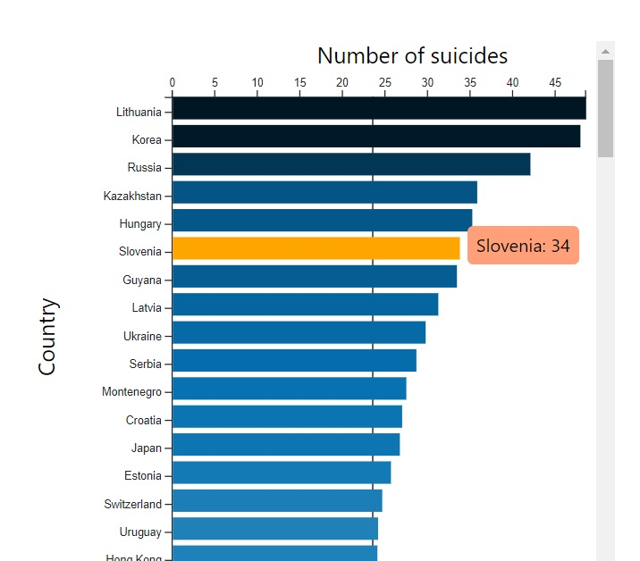

# day 6 (14 - 01 - 2018)
Did not come to school was sick.

# day 7 (15 - 01 - 2018)
Made the sunburst it was hard to transform my data in the right format.
But once transformed I didn't have to change any of the example code.
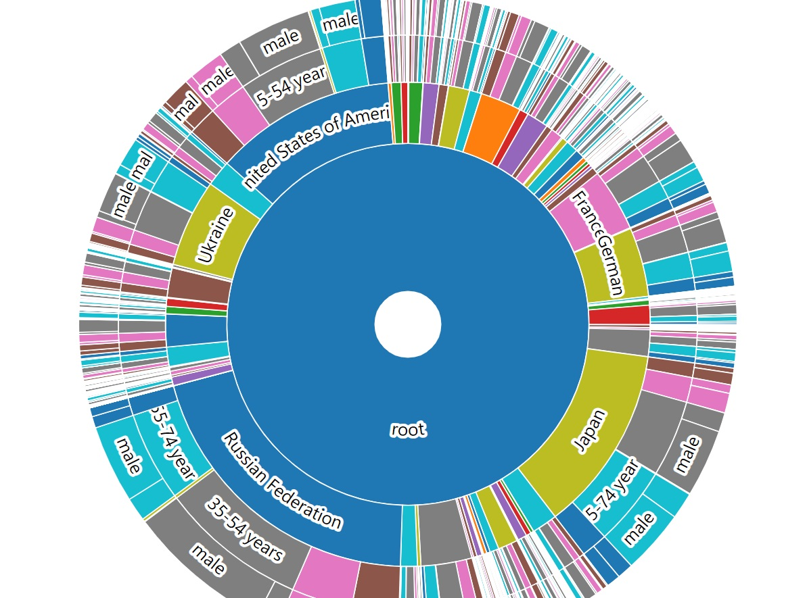
However, as visible in the picture, using a sunburst with a big data set makes it a bit unclear. Especially countries with very small number of suicides. I asked my teammates for some advice on how to make it look clearer. They suggested : do a dropdown button with top 50 data, all data etc. or do a search bar where when someone types in a country the chart will zoom in that country.

# day 8 (16 - 01 - 2018)
Updated the map. When the user choses a new year with the slider. The data from the map is updated and the colors change.
Tried to update the bar chart but it nothing happened.

# day 8 (17 - 01 - 2018)
When the user uses the dropdown filter by age the data is filtered and the map is updated.
The bar chart also updates when the user uses the slider. Not sure why it didn't work the day before.
I only changed the position of the .merge(). at first I was merging at the end but now I append the data then merge immediately.
When filling the color of the bar chart, the barchart breaks again.
Also when the user choses a filter and then updates the map using the slider the filter is forgotten. Cant solve it
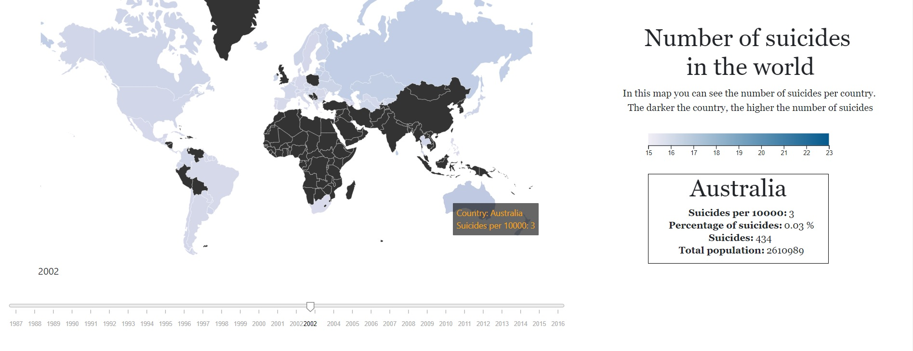

# day 9 (18  - 01 - 2018)
The bar chart updates work.
I didn't like the sunburst so I decided to change the colors. Not sure if this makes it clearer or not.
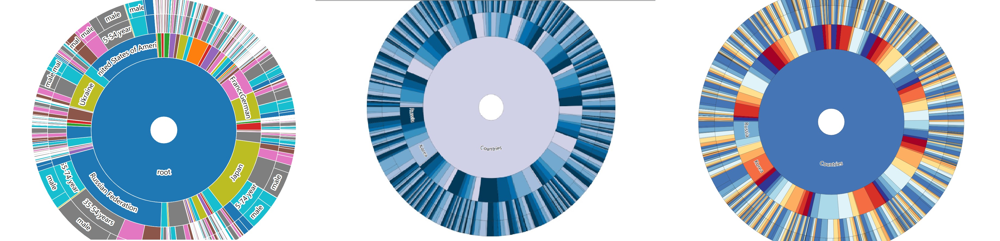
The progression of the design of the sunburst so far is seen in the picture.
The new colors are colorblind sensitive.

# day 10 (21 - 01 - 2018)
I added a filter sunburst method.
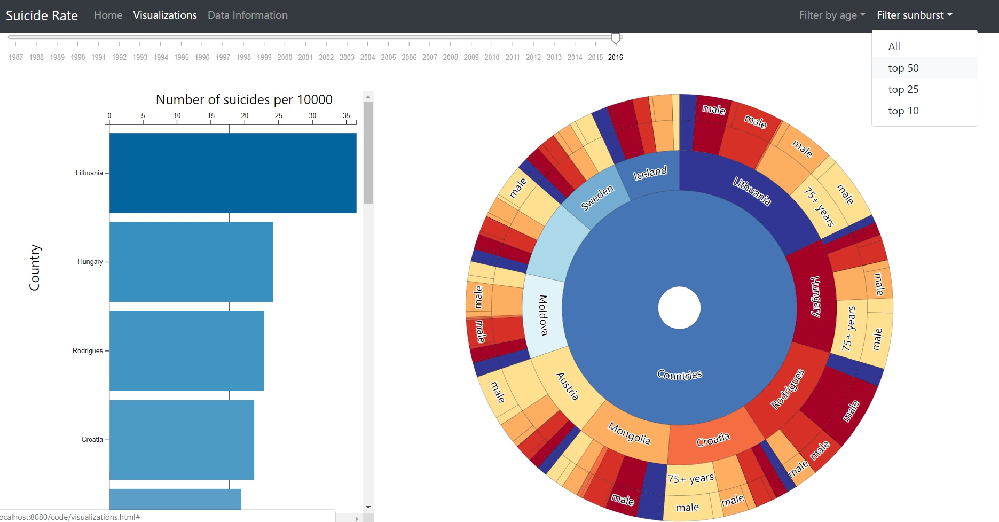
My visualizations are mostly linked. When someone filters by age, and then changes the year the filter is remembered.
I have 2 bugs to be fixed. When the sunburst is updated, then the year is changed if the user had a filter (such as 5 - 14 years), this filter is lost.
Moreover, I need to remove countries that have a value smaller than 1 in the barchart.
I also want to add another feature where filter by gender is possible.
My code is a mess and needs to be reviewed as well.

# day 11 (22 - 01 - 2018)
Worked from home today.
Fixed 2 bugs with the interactions. And tried out some new code to possibly improve my current code.

# day 12 ( 23 - 01 - 2018)
Removed values with zeroes in the barchart because values with zeroes are not very clear in the chart(see image). Moreover, 0.2 suicides does not mean anything.
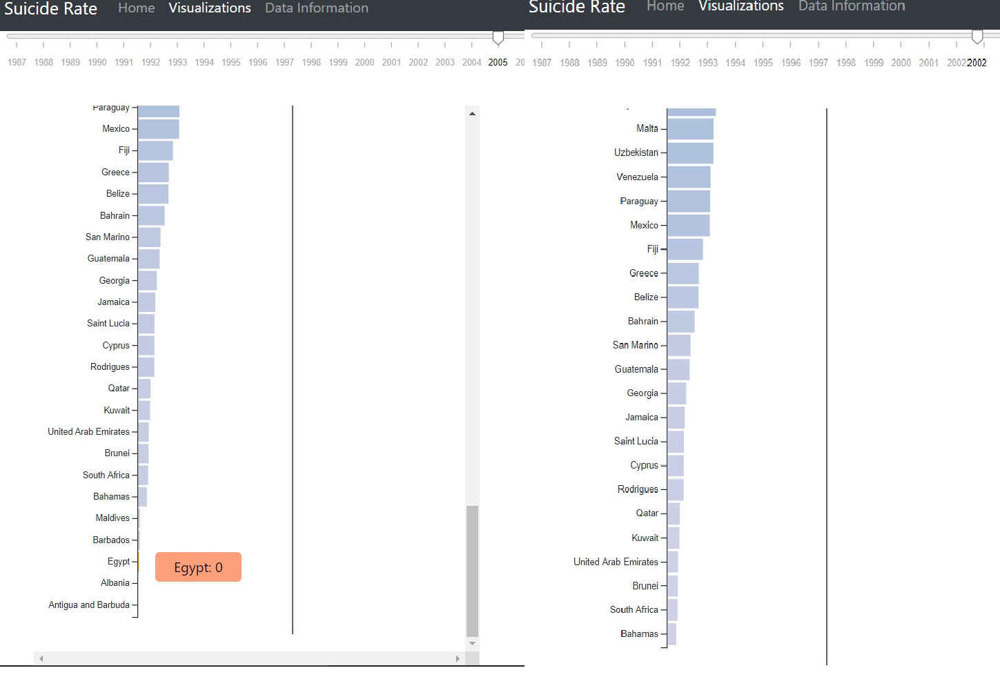
Added a filter by gender option
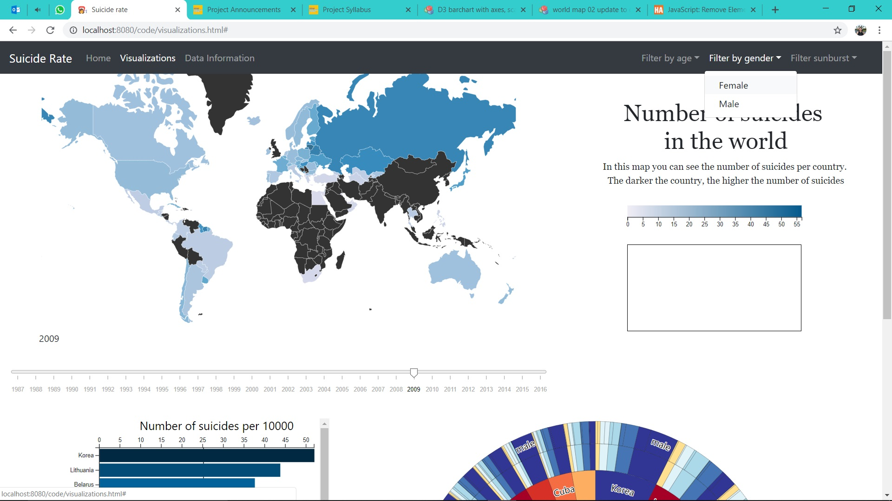

# day 13 (24 - 01 - 2018)
Hackaton

# day 14 (25 - 01 - 2018)
I made the beta verion of the website.
Which included a whole new page. With 2 new data sets.
This is very similar to my linked view assignment. I decided to add them because it provides more mental health visualizations related to suicide but not the same. It offers a zoomed view of these data in one country, as opposed to the whole world.
The first map shows suicidal thoughts.
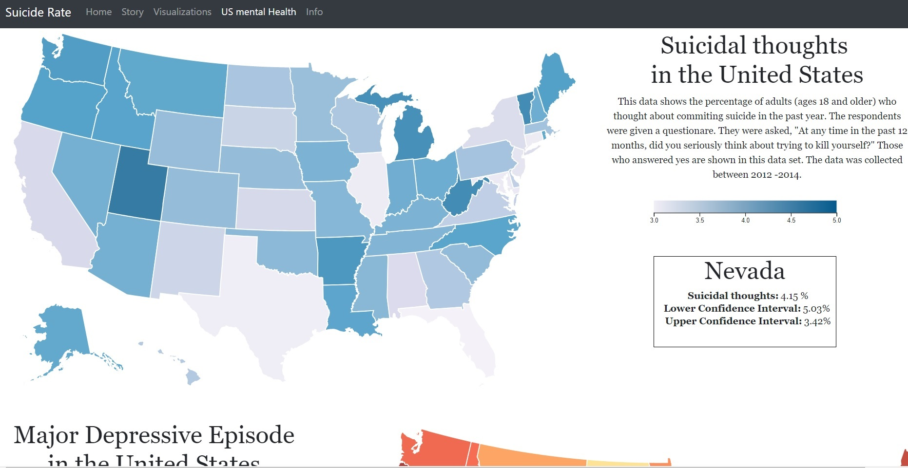
The second map shows major depressive disorder which is a disorder that may lead to suicide.
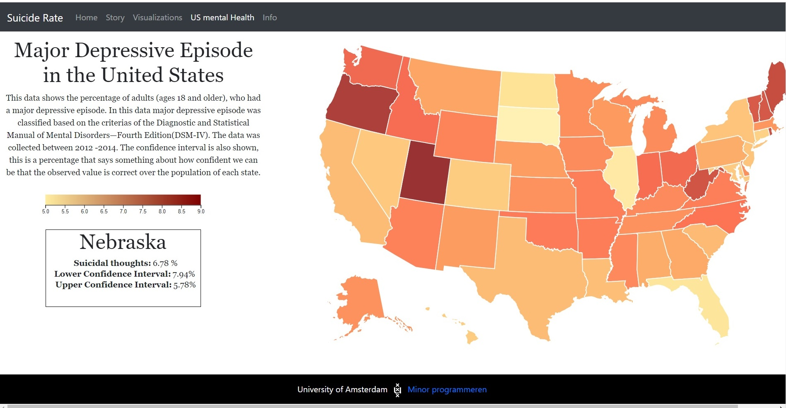
I also added more information about the new data set on the info page
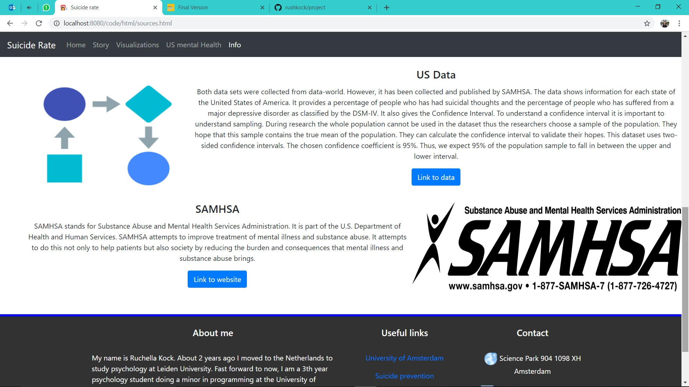
I added a footer to each page

# day 15 (29 - 01 - 2018)
I worked on the style of my code. I also optimized my code (e.g. map went from almost 400 lines to 293).
I also fixed one bug for the lineargradient on the uspage. (in beta versie it was blue for the yellow/orange map).
I checked the text for typos and checked if the links work.
I made sure all my files have proper sources and a description.
Still have 2 more ideas for optimization namely the sort function in one function and foundcolor function in main.
I also made sure my github folder structure is good.

# day 16 (30 - 01 - 2018)
Made the product video. Changed my readme and made some small changes to my code. 
