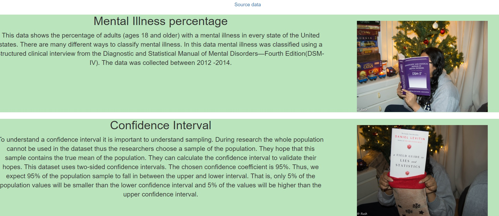
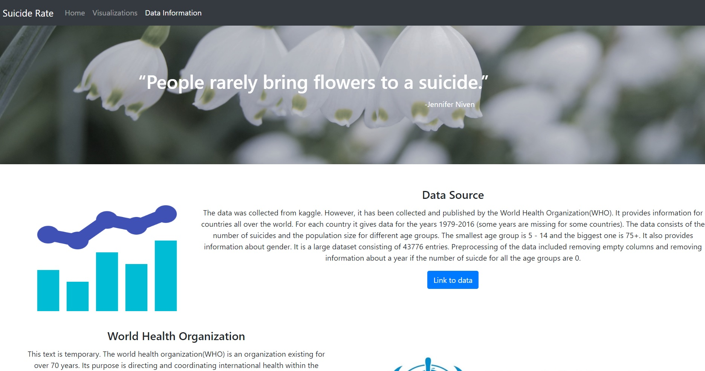
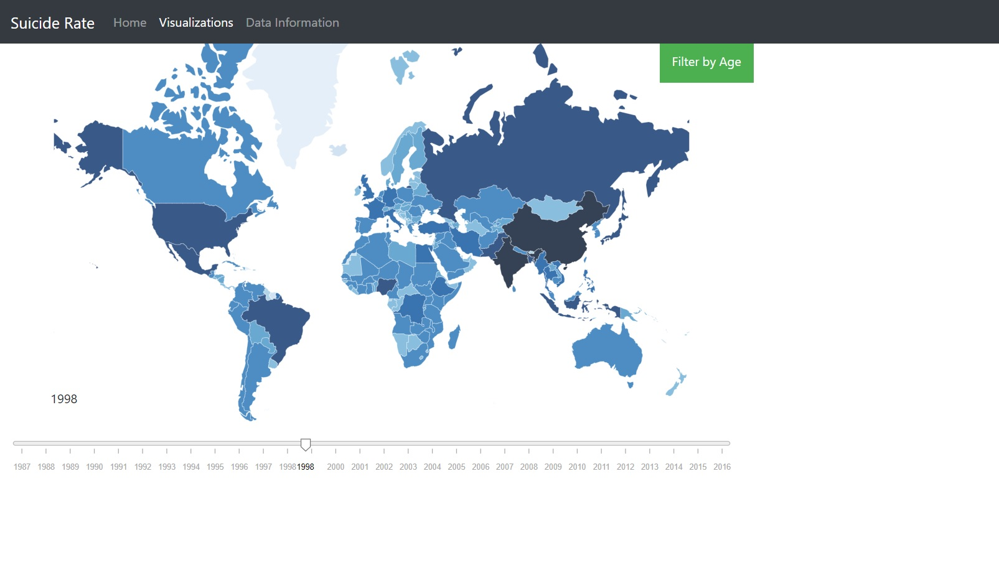
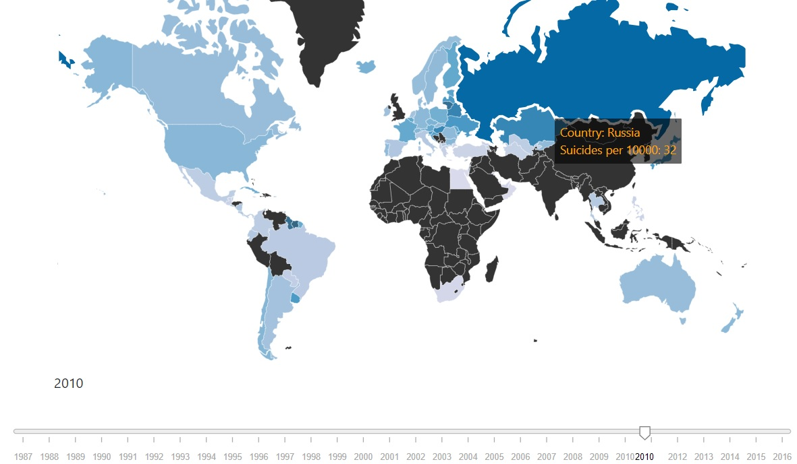
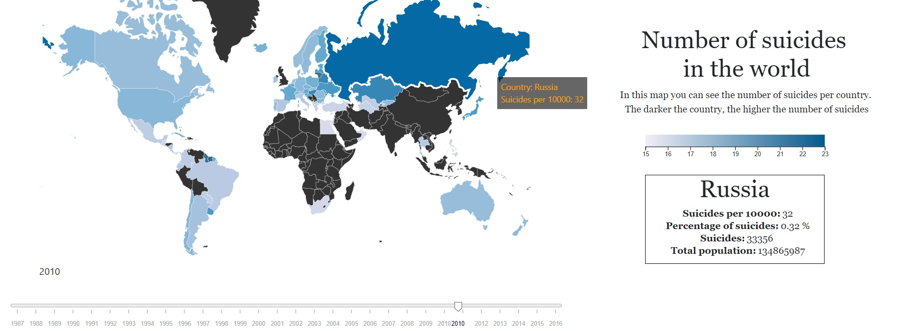
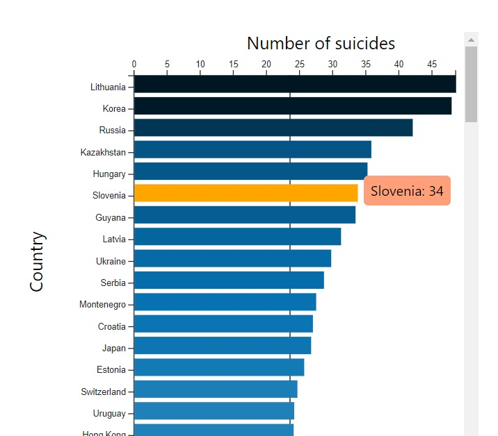
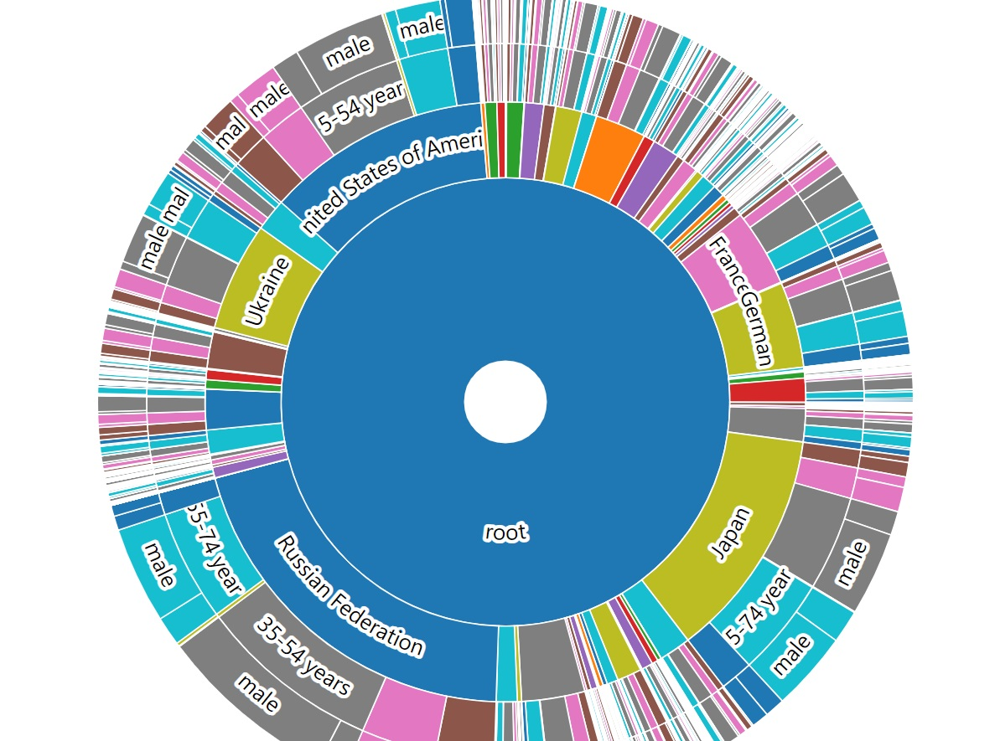
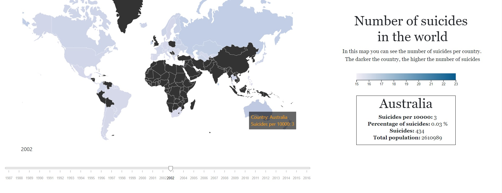
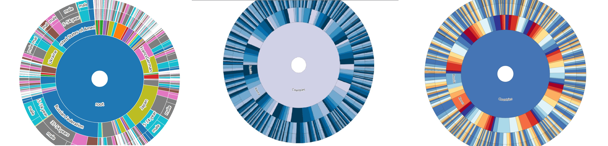

# day 2 (8 - 01 - 2018)
I made the design of the Home and Sources page.
At first I was using colored divs to seperate my text.

However, I discovered bootstrap cards. Which I used in my design in place of divs.
Ultimately I feel cards are handier to use and easier to contain. They also make the code a bit more readable.

# day 3 (9 - 01 - 2018)
I started the day preprocessing my data. I feel I have discovered an important part of pandas.
I used GroupBy to group my data based on country and year. Many transformations can be performed on these groups.
Illustrated in the [GroupBy article](http://pandas.pydata.org/pandas-docs/stable/groupby.html).
Of the most notable ones, you can sum your groups, calculate mean, std and many more statistics.
You can also transform your data such as calculate the Z score and transform the values to Zvalues.
For the preprocessing, I removed years where all the number of suicides were 0. I also removed empty cells.
This file is in [suicide.json](project/data/suicide.json).
I summed all the values for each group (so each country and each year has 1 value for the number of suicides).
This can be found in [suicide_pooled.json](project/data/suicide_pooled.json).

I also started the visualization of the heatmap.
Here is a picture of what it looked like at the end of the day.
My data was not loaded in yet, and none of the links for filtering work.

# day 4 (10 - 01 - 2018)
I linked my data to my map. I learned that a lot of countries are missing in my data.
I did not make any big insights but I do have a big to do list.
- Most importantly a suicide number of a country with a big population will most likely be higher than that of a country with a small population.
In this case the colours do not say anything. I need to find a solution for this.
- Write the update function.
- All visualizations should be done next week Friday thus I need to work on those before I link my visualizations.
- Another thing to note is that you cannot use window.onload twice. A main file must be made that calls all the functions at the same time.

# day 5 (11 - 01 - 2018)
I decided to calculate the number of suicides per 10000. As that gives more insight and makes it better comparable.

I also made a side box. Where when you hover over a country more data appears in the box.

I finished the bar chart. Which was very long so I decided to make the user be able to scroll through it.

# day 6 (14 - 01 - 2018)
Did not come to school was sick.

# day 7 (15 - 01 - 2018)
Made the sunburst it was hard to transform my data in the right format.
But once transformed I didn't have to change any of the example code.

However, as visible in the picture, using a sunburst with a big data set makes it a bit unclear. Especially countries with very small number of suicides. I asked my teammates for some advice on how to make it look clearer. They suggested : do a dropdown button with top 50 data, all data etc. or do a search bar where when someone types in a country the chart will zoom in that country.

# day 8 (16 - 01 - 2018)
Updated the map. When the user choses a new year with the slider. The data from the map is updated and the colors change.
Tried to update the bar chart but it nothing happened.

# day 8 (17 - 01 - 2018)
When the user uses the dropdown filter by age the data is filtered and the map is updated.
The bar chart also updates when the user uses the slider. Not sure why it didn't work the day before.
I only changed the position of the .merge(). at first I was merging at the end but now I append the data then merge immediately.
When filling the color of the bar chart, the barchart breaks again.
Also when the user choses a filter and then updates the map using the slider the filter is forgotten. Cant solve it

# day 9 (18  - 01 - 2018)
The bar chart updates work.
I didn't like the sunburst so I decided to change the colors. Not sure if this makes it clearer or not.

The progression of the design of the sunburst so far is seen in the picture.
The new colors are colorblind sensitive.
