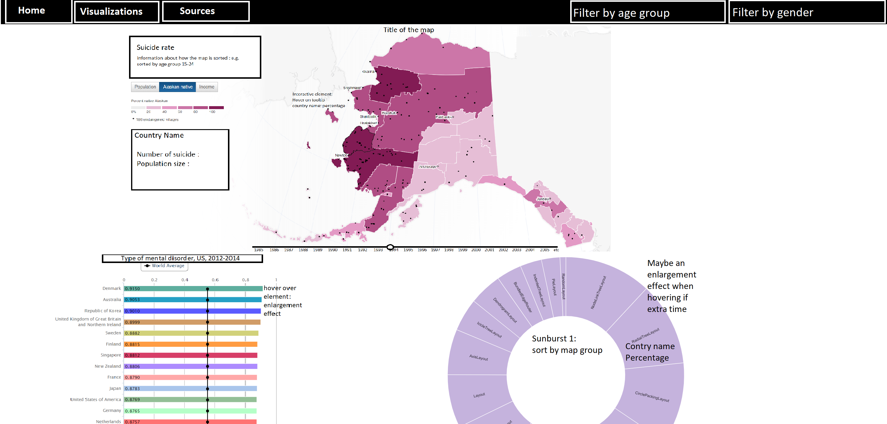

# Suicide rate per country
## Author
Ruchella Kock (rushkock on github) :octocat:

## Github Pages
[Link to Github Pages](https://rushkock.github.io/project/project/code/home.html)

## Summary
This website will make a heat map, bar chart and zoomable sunburst diagram in order to help visualize the prevalence of suicide over the world for non-academics.

## Problem statement
There is a lot of data and information about different mental health diseases. There are many papers describing prevalence rates of mental disorders (e.g. Anderson, Freedland, Clouse, & Lustman, 2001; Nock, et al., 2008). However, based on my experience these papers use tables instead of visualizations to show the data. Moreover, if visualizations are used it is complicated and academic as in the case with the paper by Nock and colleagues (2008). This website aims to provide clear visualizations for non academics who are interested in prevalence rates of suicide over the whole world.

## Solution
I will provide clear visualizations (Namely a bar chart, heatmap and zoomable sunburst) for the prevalence of suicide with data from the whole world. It will have interactive components which can make the data clearer, understandable and perhaps more interesting for non-academics.

### Home page
The home page provides information about the problem, the data set and perhaps additional information of what the website can be used for and how it can be used.

### Visualization page
This is what the visualization tab will approximately look like

## Main features
- Heat map with tooltip and when hovering information on screen updates in separate box (Seen on the left side underneath in picture)

[source](https://www.theguardian.com/environment/interactive/2013/may/14/alaska-villages-frontline-global-warming )

[source](http://bl.ocks.org/micahstubbs/8e15870eb432a21f0bc4d3d527b2d14f)
- Bar chart

[source](https://publicadministration.un.org/egovkb/en-us/Data/Compare-Countries)
- Zoomable sunburst diagram with enlargement effect

[source](https://beta.observablehq.com/@mbostock/d3-zoomable-sunburst)
- Dropdown sort by age
In this dropdown the user can choose one specific age group (E.g. 5 -14). The map is updated, the user can see in which country the most suicides occurred in that age group
- Dropdown sort by gender
In this dropdown the user can choose between male and female. The map is updated, the user can see in which country the most suicides occurred for males or females
- Slider for the years
The user can move the slider and see how the data changes per year
- Tooltip with extra information
- Enlargement while hovering

## The minimum viable product (MVP)
-	Heat map with tooltip and when hovering information in separate box (See heatmap)
-	Bar chart with enlargement effect
-	Zoomable sunburst diagram with enlargement effect
-	Dropdown sort by age
- Slider per year
-	Tooltip with extra information

## Optional to implement.
- Enlargement while hovering
- Dropdown sort by gender
- Make it possible to sort by both age and gender at the same time per example male age group 5 - 14
- Option to type in the year instead of slide to get the year

## Prerequisites
### Data sources
[WHO suicide statistics](https://www.kaggle.com/szamil/who-suicide-statistics)
Transformations: remove outliers and remove countries with no data

### External components
- d3 version (5.7.0)
- d3 tooltip
- bootstrap
- flare visualization toolkit

### Previous implementation
My website I find to be most similar to this website [CSRIB](https://dboekhout.github.io/CSRIB/).
The use of a heat map and bar charts. This website also allows the possibility to sort by country (which would be sort by age or gender in my case). It also offers interactive elements such as the tooltip and enlargements.

[This](http://www.humanosphere.org/global-health/2013/06/visualize-mental-illness/) webpage offers some visualizations of mental health.
It is similar in terms of it also visualizes mental health. However, it is not interactive. Similar to my proposal there is a heat map.

[This](https://ourworldindata.org/mental-health) website also offers visualizations of mental health. The format is more of a paper with static visualizations to view the data. It also uses heat maps and bar charts.

### Challenges
Preprocessing, cleaning and sorting the data I believe will be challenging. The data is very large and it is hard to decide when to remove something like 0 suicides because it could be there was no information in that year or just no suicides in that year. In technical terms I believe the zoomable sunburst diagram will be the hardest to implement. It is something I have not done before. It may also be hard to make it a clear and functional visualization. Rather, instead of making the data clearer for everyone if not implemented properly it may make it more confusing. The slider may also prove difficult.

## References
- Anderson, R. J., Freedland, K. E., Clouse, R. E., & Lustman, P. J. (2001). The prevalence of comorbid depression in adults with diabetes: a meta-analysis. Diabetes care, 24(6), 1069-1078.
- Nock, M. K., Borges, G., Bromet, E. J., Alonso, J., Angermeyer, M., Beautrais, A., . . . Williams, D. (2008). Cross-national prevalence and risk factors for suicidal ideation, plans and attempts. The British Journal of Psychiatry , Ron, 192(2), 98-105.
