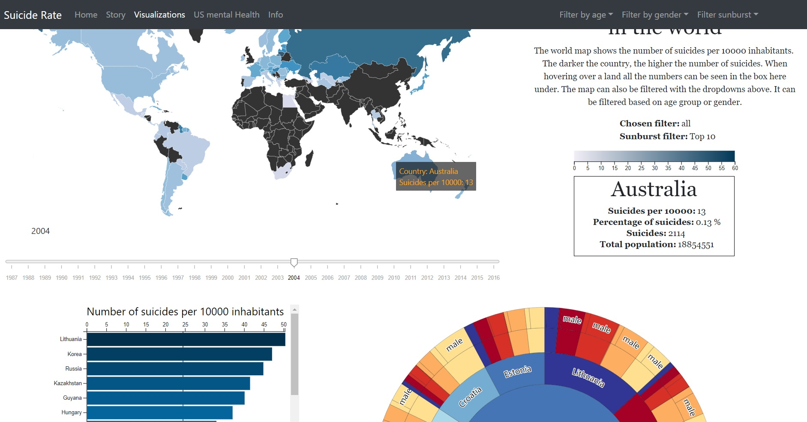

# Suicide rate per country
## Author
Ruchella Kock (rushkock on github) :octocat:

## Github Pages
[Link to Github Pages](https://rushkock.github.io/project/project/code/html/home.html)

## Product video
[Product video](https://www.youtube.com/watch?v=PUVdg6iTivY&feature=youtu.be)

## Summary
This website contains a home page, 5 visualizations (3 maps, a bar chart and a zoomable sunburst diagram) and a page for all information. Its purpose is to visualize the prevalence of suicide over the world for non-academics.

## Home page
When the website is loaded a few images are shown with quotes to give hope against suicide.

### Story
The story contains information about the problem and solution. Essentially it contains information about why the website was made and what it contains.
It is part of the home page. Can also be accessed by clicking on story in the navbar

## Visualization page
The visualization page contains 3 linked views.

### World map
The worldmap contains:
- A slider to change the year
- It can be filtered by age group (Button top right on screen)
- It can be filtered by gender (Top right of screen)
- It has a tooltip
- It also contains a box with additional information when hovering over a country

### Bar chart
The bar chart:
- Can be changed with the slider it is updated depending on the chosen year
- Has a tooltip

### Zoomable sunburst
The sunburst:
- Is updated with slider
- Can be filtered with the filter sunburst button (top right). When the page is loaded it shows the top 10 countries with suicides. However, it can show the top 25, top 50 or all the countries.
- Has a tooltip
As it is zoomable the user can click on any part of it and it will zoom in on that area

## US mental health
The US mental health page contains 2 maps of the United States
The first map visualizes suicidal thoughts in each state. On hover the percentage and confidence intervals are shown in the box next to the map.
The second map shows major depressive disorder which is a disorder that may lead to suicide. On hover it shows the percentage in the box.

## Data Information
The information tab contains information about the data sets used.
It also contains additional contact information in the footer.

### Link to data sets
- [WHO suicide statistics](https://www.kaggle.com/szamil/who-suicide-statistics)

Transformations: removed outliers and removed countries with no data
- [US suicidal thoughts](https://data.world/samhsa/serious-thoughts-of-suicide)
- [US depression statistics](https://data.world/samhsa/major-depressive-episode)

### External components used
- d3 version (5.7.0)
- bootstrap

## Copyrights
_Copyright (c) 2019 Ruchella Kock_

I do not own any rights to the data sets.

## Sources
### Blocks
- [US map blocks](https://bl.ocks.org/mbostock/4090848) Copyright 2010-2017 Mike Bostock
- [World Map v4](http://bl.ocks.org/micahstubbs/8e15870eb432a21f0bc4d3d527b2d14f) Micah Stubbs
- [Zoomable sunburst with labels](https://bl.ocks.org/vasturiano/12da9071095fbd4df434e60d52d2d58d) Copyright (c) 2017 Vasco Asturiano
- [Slider](https://bl.ocks.org/johnwalley/e1d256b81e51da68f7feb632a53c3518) Copyright 2017-2018 John Walley
- [D3](https://d3js.org/d3.v5.min.js)Copyright 2019 Mike Bostock

### Bootstrap
- [Dropdown](https://www.w3schools.com/bootstrap/bootstrap_dropdowns.asp) Copyright 1999-2019 by Refsnes Data.
- [Cards](https://www.w3schools.com/w3css/w3css_cards.asp) Copyright 1999-2019 by Refsnes Data.
- [Bootstrap Navbar](https://www.w3schools.com/bootstrap4/bootstrap_navbar.asp) Copyright 1999-2019 by Refsnes Data.
- [Carousel](https://www.w3schools.com/bootstrap/bootstrap_carousel.asp) Copyright 1999-2019 by Refsnes Data.
- [Bootstrap footer](https://mdbootstrap.com/docs/jquery/navigation/footer/#purplepanel) © 2019 Copyright: MDBootstrap.com
- [Bootstrap](https://maxcdn.bootstrapcdn.com/bootstrap/4.1.3/css/bootstrap.min.css) Copyright (c) 2011-2018 Twitter, Inc./ Copyright 2011-2018 The Bootstrap Authors
- [Bootstrap](https://maxcdn.bootstrapcdn.com/bootstrap/4.1.3/js/bootstrap.min.js) Copyright 2011-2018 The Bootstrap Authors
- [cloudflare](https://cdnjs.cloudflare.com/ajax/libs/popper.js/1.14.3/umd/popper.min.js) Copyright (C) Federico Zivolo 2018
- [jQuery](https://ajax.googleapis.com/ajax/libs/jquery/3.3.1/jquery.min.js)(c) JS Foundation and other contributors

### Images
- [Card Images](https://icons8.com/icons/set/favicon) © 2018 Icons8 LLC.
- [Carousel Images](https://unsplash.com/photos/N9VsHXwWB-8)
- [University of Amsterdam Logo](http://www.uva.nl/en/home) Copyright UvA 2019
- [WHO Logo](https://www.who.int/) © 2019 WHO
- [SAMHSA Logo](https://www.aaap.org/samhsa-announces-new-online-course-anger-management/) © 2019 American Academy of Addiction Psychiatry.

### Github dataprocessing
- [Bar chart](https://github.com/rushkock/dataprocessing/blob/master/homework/week_4/index.html)
- [Linked View assignment](https://github.com/rushkock/dataprocessing/tree/master/homework/week_6)

### Other
- [Flare](https://gist.githubusercontent.com/mbostock/4348373/raw/85f18ac90409caa5529b32156aa6e71cf985263f/flare.json)
- [Color brewer](http://colorbrewer2.org/#type=sequential&scheme=PuBu&n=5) © Cynthia Brewer, Mark Harrower and The Pennsylvania State University
- [Legend](https://www.visualcinnamon.com/2016/05/smooth-color-legend-d3-svg-gradient.html) © 2018 - 2019 Copyrights Visual Cinnamon
- [Topojson](https://github.com/topojson/topojson-client) Copyright 2016 Mike Bostock.
- [Stack Overflow](https://stackoverflow.com/)
