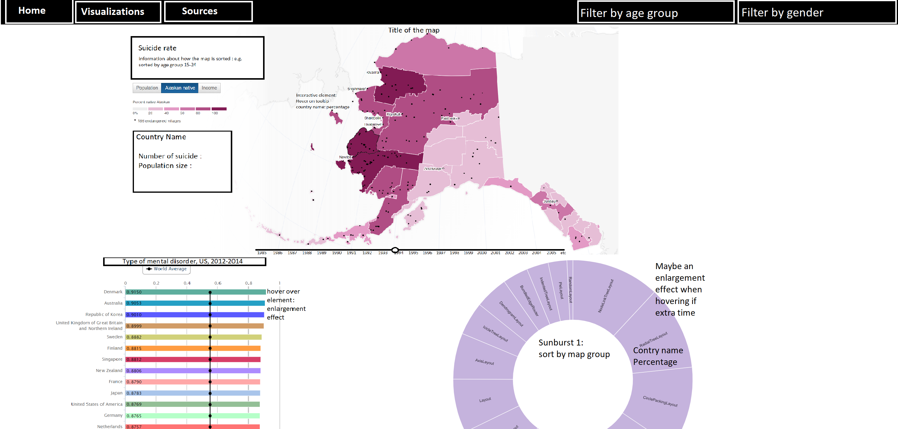
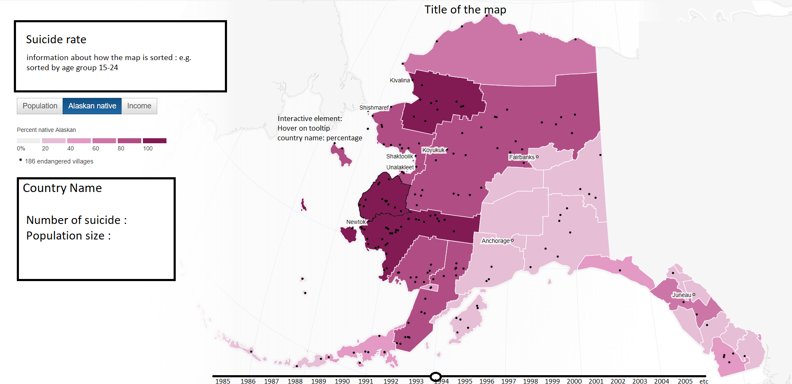
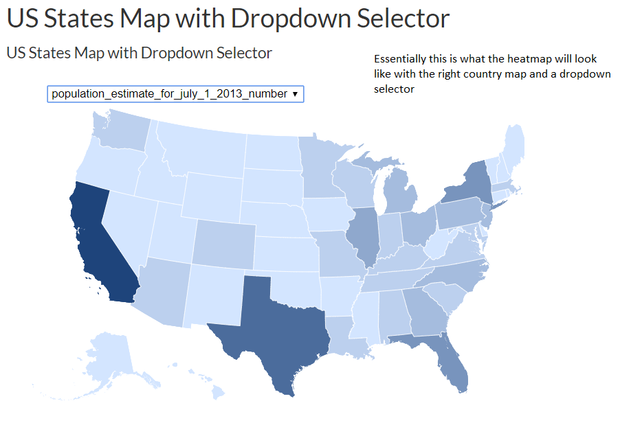
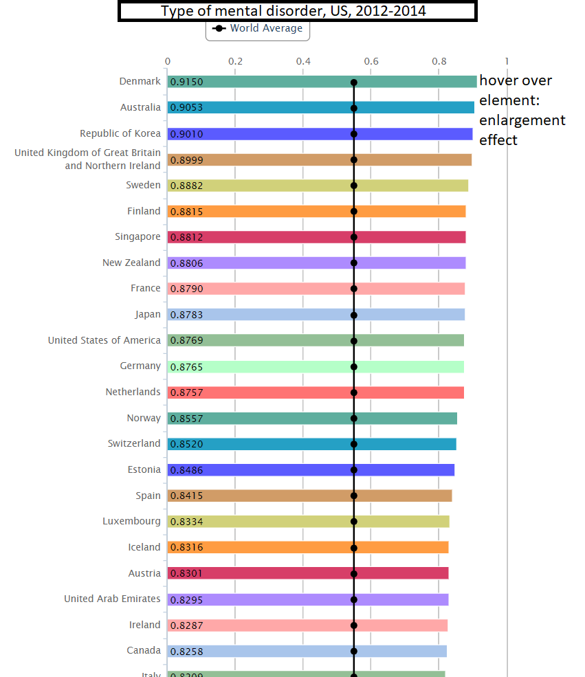
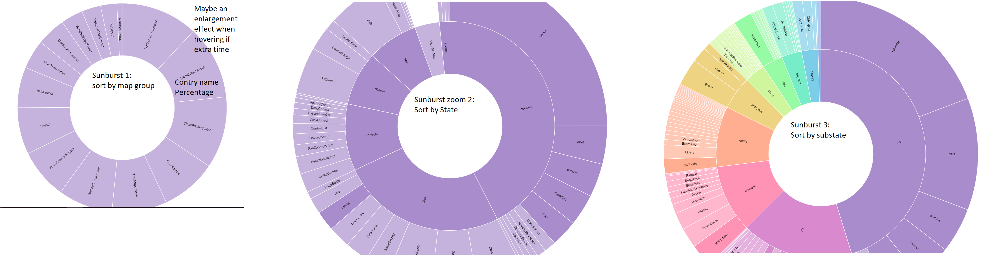
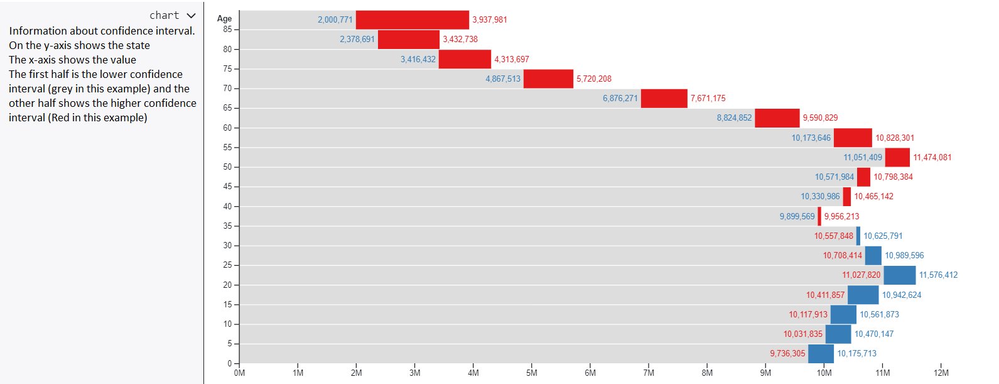

# Mental disorders in united state for ages 18 and up
## Author
* Ruchella Kock (rushkock on github) :octocat:

This website will make a heat map, bar chart and zoomable sunburst diagram in order to help visualize the prevalence of mental disorders for non-academics(as well as academics).

## Problem statement
There is a lot of data and information about different mental health diseases. There are many papers describing prevalence rates of mental disorders (e.g. Anderson, Freedland, Clouse, & Lustman, 2001; Nock, et al., 2008). However, based on my experience these papers use tables instead of visualizations to show the data. Moreover, if visualizations are used it is complicated and academic as in the case with the paper by Nock and colleagues (2008). This website aims to provide clear visualizations for academics and non-academics alike who are interested in prevalence rates of mental disorders in the united states.

## Solution
I will show the prevalence in the united states of mental disorders, serious mental disorders, depression and suicidal thoughts in 4 different graphs in order to relay information in different, clear and fast ways to the audience.

### Home page
The home page provides information about the problem, the data set and perhaps additional information of what the website can be used for and how it can be used.

### Visualization page
This is what the visualization tab will approximately look like

## Main features
- Heat map with tooltip and when hovering information on screen updates in separate box (Seen on the left side underneath in picture)

[source](https://www.theguardian.com/environment/interactive/2013/may/14/alaska-villages-frontline-global-warming )

[source](https://vida.io/gists/vfP7KiHLfDbnDWBsX)
- Bar chart

[source](https://publicadministration.un.org/egovkb/en-us/Data/Compare-Countries)
- Zoomable sunburst diagram with enlargement effect

[source](https://beta.observablehq.com/@mbostock/d3-zoomable-sunburst)
- Confidence Interval bar chart

[source](https://beta.observablehq.com/@mbostock/u-s-population-by-age-and-sex/3)
- Dropdown sort by state
In this dropdown all the states will be available. Once a state is chosen these are highlighted perhaps with both the use of colour and or enlargements. The data for the other states will be in the background.
- Dropdown sort by type of disorder
This will provide the possibility to change between the datasets. Essentially providing the same visualizations but for a whole other dataset.
- Tooltip with extra information
- Enlargement while hovering

## The minimum viable product (MVP)
-	Heat map with tooltip and when hovering information in separate box (See heatmap)
-	Bar chart with enlargement effect
-	Zoomable sunburst diagram with enlargement effect
-	Dropdown sort by type of disorder
-	Tooltip with extra information

## Optional to implement.
- Confidence interval bar chart
- Perhaps working with all 4 datasets may be optional I may just choose 2 to start
- Enlargement while hovering
- Dropdown sort by state

## Prerequisites
### Data sources
[Thoughts of suicide](https://data.world/samhsa/serious-thoughts-of-suicide)

[Major depressive episode](https://data.world/samhsa/major-depressive-episode)

[Serious mental illness](https://data.world/samhsa/serious-mental-illness)

[Any mental illness](https://data.world/samhsa/any-mental-illness)

Note: no transformations necessary

### External components
d3 version (5.7.0)
flare visualization toolkit

### Previous implementation
My website I find to be most similar to this website [CSRIB](https://dboekhout.github.io/CSRIB/).
The use of 4 visualizations. Including a heat map and bar charts. This website also allows the possibility to sort by country (which would be sort by state in my case). It also offers interactive elements such as the tooltip and enlargements.

[This](http://www.humanosphere.org/global-health/2013/06/visualize-mental-illness/) webpage offers some visualizations of mental health.
It is similar in terms of it also visualizes mental health. However, it is not interactive. Similar to my proposal there is a heat map.

[This](https://ourworldindata.org/mental-health) website also offers visualizations of mental health. The format is more of a paper with static visualizations to view the data. It also uses heat maps and bar charts.

### Challenges
Using data from 4 different datasets could be challenging. In technical terms I believe the zoomable sunburst diagram will be the hardest to implement. It is something I have not done before. It may also be hard to make it a clear and functional visualization. Rather, instead of making the data clearer for everyone if not implemented properly it may make it more confusing.

## References
- Anderson, R. J., Freedland, K. E., Clouse, R. E., & Lustman, P. J. (2001). The prevalence of comorbid depression in adults with diabetes: a meta-analysis. Diabetes care, 24(6), 1069-1078.
- Nock, M. K., Borges, G., Bromet, E. J., Alonso, J., Angermeyer, M., Beautrais, A., . . . Williams, D. (2008). Cross-national prevalence and risk factors for suicidal ideation, plans and attempts. The British Journal of Psychiatry , Ron, 192(2), 98-105.
