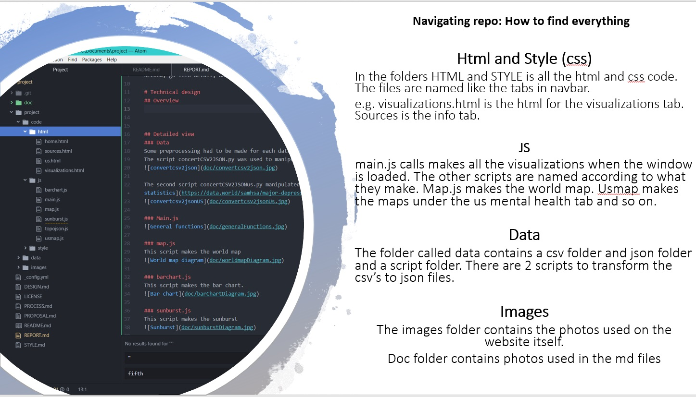
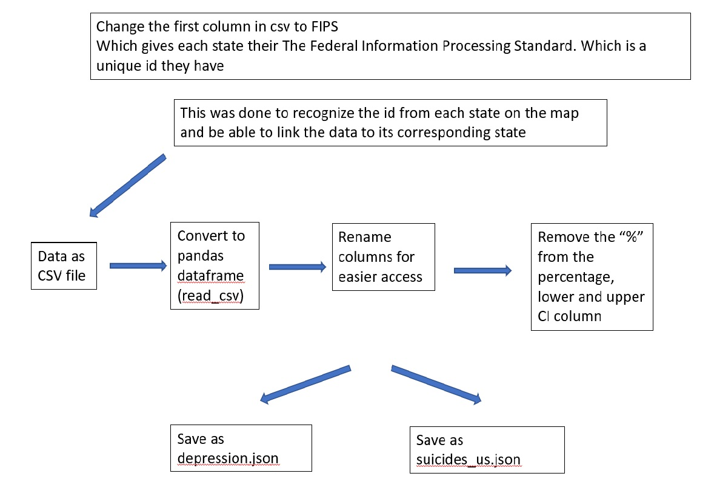
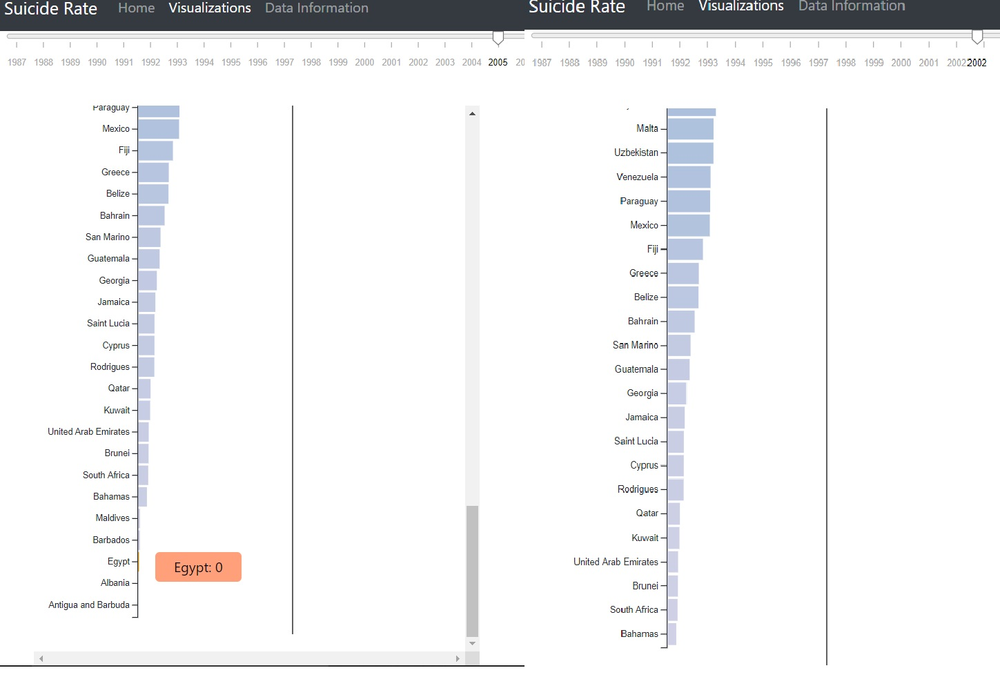

# Author
Ruchella Kock (rushkock on github) :octocat:

# Description
This website contains a home page, 5 visualizations (3 maps, a bar chart and a zoomable sunburst diagram) and a page for all information. The map can be filter by age and gender. The sunburst can be filtered to show more or less data. All the visualizations are dependent on the year(which can be changed with the slider). All the visualizations on the visualizations tab contain a tooltip. The purpose of the website is to visualize the prevalence of suicide over the world for non-academics.

# Technical design
## Overview

## Detailed view
Note if the textbox is connected to another textbox it shows that this function calls the other function.

### Data
Some preprocessing had to be made for each data set. For that I have 2 scripts.
The script concertCSV2JSON.py was used to manipulate the [WHO suicide statistics](https://www.kaggle.com/szamil/who-suicide-statistics).

The second script concertCSV2JSONus.py manipulated the [US suicidal thoughts](https://data.world/samhsa/serious-thoughts-of-suicide) and [US depression statistics](https://data.world/samhsa/major-depressive-episode) data sets.

### Main.js

### map.js
This script makes the world map

### barchart.js
This script makes the bar chart.

### sunburst.js
This script makes the sunburst

### usmap.js
This script makes the 2 maps on the usmap page

## Challenges
Biggest challenge while making this assignment turned out to be linking the visualizations and filtering them. It took me a whole week to filter the data. I only have one onclick function and two filter functions, but 3 dropdowns.
Technicalities as to why:
Filter by age and gender were very similar but filter by sunburst is very different. In the onclick I get the right value and id but when id is changed from "age" or "gender" to "sunburstDropdown" the age/gender filter is lost for the map.
Also the filter was often lost when the year was changed because the slider didn't know what the value/id was. I had to make value and id a general variable.

A big challenge I faced was that I decided to use the data I selected for this project, in my linked view assignment. This is because I couldn't find a data set in time. In January I chose this dataset without exploring it. It turned out to have a lot of missing values. It also had a lot of zeros which could mean different things. Perhaps there was no suicide in that country or perhaps there was no data in that year. Deciding how to preprocess these zeros was a challenge. How do I choose which zero's I should keep and which ones to remove. In the end I decided that if for a country and year all the number of suicides were zero there was no data for that year and I removed that year from the dataset.

Writing efficient code was also a struggle. Deciding between making something like the tooltip a general variable, passing it on to the next function or selecting it again in the function that needs it was though.

## Design Choices
### Placement
The design decisions I had to make were harder than I thought. Per example placement of the visualizations. Should I put the usmap in a new tab (and make the navbar bigger) or on the same page as the other visualizations (thus making the page longer and maybe more crowded).
I decided to put it on a new tab because it was a different data set and also not directly related to the visualizations in the visualizations tab.
This tab had data for suicide all over the world. The us tab had data for suicidal thoughts and depressive episode only for the United States. Although they are both related to mental health, they aren't exactly related to each other.

I decided to make the barchart vertical and not horizontal to place it next to the sunburst. I think the sunburst and barchart compliment each other. The sunburst offers more information about the age groups and gender but the barchart offers a broad overview which may be interesting when navigating the sunburst.

The barchart is very long. More than a 1000 pixels. Thus I decided to make it scrollable. However, when scrolling down the x axis is not visible anymore. That is why I decided to draw a line in the middle. To put the bars into perspective.
I also decided to sort the bars from big to small and visualize it in that order. I believe that the countries with the most suicide may be most interesting to the user.

### Colors
- Map

Should I change the domain of the color function when it is filtered (because this data set has a smaller maximum value). If I do this the user can clearly see the differences between the countries in each filter. Or should I keep the same domain, this way the user can see that when the data is filtered, there are less people that committed suicide compared to when there is no filter.
I decided to choose the second option, because I believe that the sunburst shows the first option. The sunburst shows per country which one had the most suicides, then per country which age group was bigger, then per age group which gender was bigger. Thus the world map gives a more general view and for a more country specific view the sunburst can be consulted.

Moreover, the color range I chose for the map was a design choice I would change if I could go back in time. Dark blue looks a lot like black thus the user may think that black (the countries with no data) had a lot of suicides or that some countries that are actually dark blue (such as Lithuania) have no data. I would probably change no data from black to another color such as red or change the color scheme.
However, I tried solve this problem by adding a black legend that says no data next to the linear legend, in the hopes that this makes it clear that black means no data and not more suicides. Furthermore, when hovering over a country with no data the tooltip says no data (this was also a choice I made because I could also say that when hovering over a country with no data there is no tooltip).

- Barchart

Should the barchart have colors depending on how big the bar is or should it just have one general color.
The barchart uses the same colors as the map. That is why there is only one legend (If given more time I would have also made a legend for the barchart). I chose not to give the barchart only one color because of the above choice I made, to make the user be able to scroll down to see the whole chart. The color change then may add some additional information as to how big these values are.

- Sunburst

Choosing the colors for the sunburst was also difficult. This is because I could not use the same color scheme as the barchart and map because it is not sequential data. I still had to choose a color scheme that is clear and fits in with the page.

### Other
One of the most important choices I made was to calculate suicides per 10000.
If I didn't do this then the colors, the size of the bars in the barchart and also the size of the arcs in the sunburst would not mean much.
This is because a country with a big population will likely have a lot more suicides than a country with a smaller population. Thus the raw values do not put in to perspective which countries actually had the most suicides compared to other countries.

The sunburst is not very clear with a huge dataset. This is because the labels do not fit on the small boxes.
I decided to add a dropdown to let the user filter the sunburst. When only 10 countries are shown the sunburst is a lot clearer.

In the barchart I decided to remove values with 0 suicides. These countries were so small that they were almost invisible. I also did not feel as if they give a lot of information.

# Future work
If I had more time. I would add checkboxes so that the user can choose 2 filters at the same time (e.g. How many males between the ages of 75+ committed suicide in Russia in 2010). I would also have an option to filter the barchart as well. As I mentioned I would add a legend for the barchart or move the placement of the map legend so that it is also visible near the barchart.
I would choose another colorscheme for the map.
